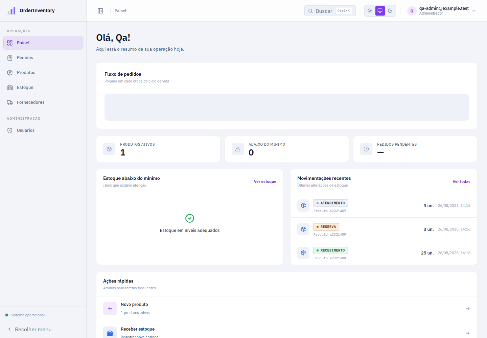
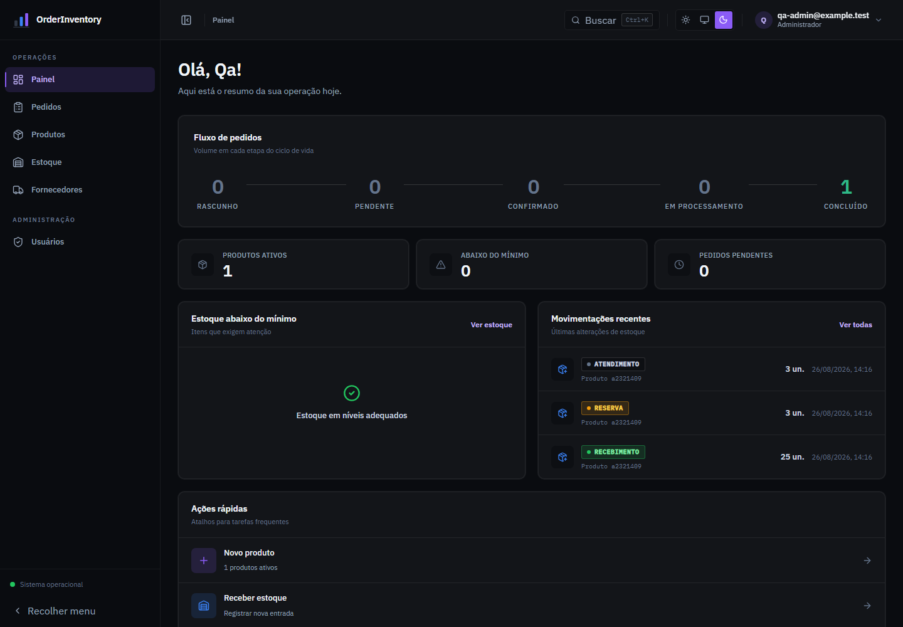
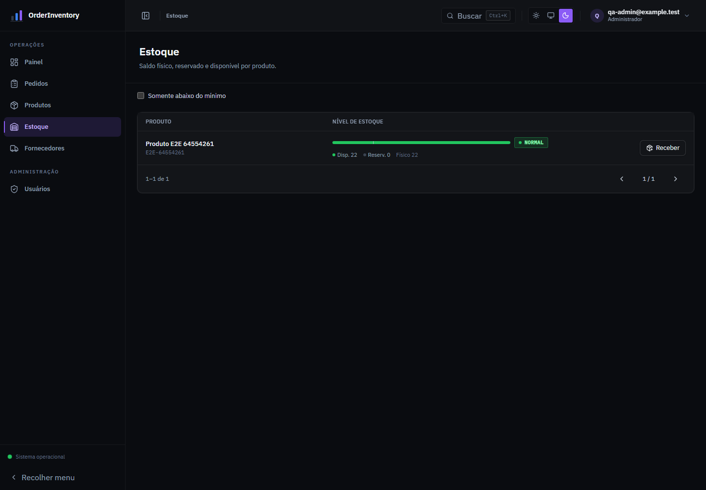

<div align="center">

# OrderInventory

**Gestão de catálogo, fornecedores, pedidos e estoque com consistência transacional.**

Um sistema full stack para operações de inventário, construído como monólito modular e focado em regras de negócio reais: reservas concorrentes, rastreabilidade de movimentações, autorização por perfil e proteção de invariantes no PostgreSQL.

**Status: Development complete — public deployment pending**

[](https://dotnet.microsoft.com/)
[](https://react.dev/)
[](https://www.typescriptlang.org/)
[](https://www.postgresql.org/)
[](https://github.com/guilhermedev66/OrderInventory/actions/workflows/ci.yml)

</div>

## Preview

| Dashboard — light mode | Dashboard — dark mode |
| --- | --- |
|  |  |



> As imagens usam dados fictícios gerados exclusivamente para validação do projeto.

## O problema que o projeto resolve

Operações de estoque parecem simples até pedidos simultâneos disputarem as últimas unidades. O OrderInventory centraliza catálogo, fornecedores, saldos, movimentações e pedidos sem tratar consistência como responsabilidade exclusiva da interface.

O resultado é um fluxo operacional completo, com regras verificadas no domínio, transações na aplicação e invariantes protegidas também pelo banco de dados.

## Principais funcionalidades

- Dashboard operacional com indicadores, alertas de estoque e movimentações recentes.
- Catálogo de produtos com SKU único, preço histórico nos pedidos e ativação/inativação.
- Gestão de fornecedores e vínculo entre fornecedor e produto.
- Recebimento, reserva, liberação e atendimento de estoque com trilha auditável.
- Pedidos com lifecycle controlado e operações administrativas por perfil.
- Autenticação JWT com roles `User`, `Manager` e `Admin`.
- Interface responsiva, temas claro/escuro, command palette, dialogs e estados de loading/empty/error.
- API documentada por OpenAPI/Swagger e monitorada por health check.

## Arquitetura

O backend é um monólito modular em .NET 10:

```text
OrderInventory.Api ──────────────┐
        │                        │
        v                        v
OrderInventory.Core    OrderInventory.Infrastructure
                                 │
                                 v
                            PostgreSQL 18

client (React/TypeScript) ──HTTP/JWT──> OrderInventory.Api
```

- `OrderInventory.Api`: API REST, DTOs, autenticação, autorização, erros e composição.
- `OrderInventory.Core`: entidades e invariantes de produtos, fornecedores, estoque e pedidos.
- `OrderInventory.Infrastructure`: EF Core, migrations e operações SQL transacionais.
- `OrderInventory.UnitTests`: regras e transições do domínio.
- `OrderInventory.IntegrationTests`: API, persistência, concorrência e PostgreSQL real via Testcontainers.
- `client`: painel operacional React integrado aos contratos reais da API.

As dependências seguem `Api -> Core`, `Api -> Infrastructure` e `Infrastructure -> Core`. O projeto evita complexidade sem necessidade: não usa microsserviços, mensageria, CQRS, MediatR ou repositório genérico.

## Stack

| Área | Tecnologias |
| --- | --- |
| Backend | .NET 10, ASP.NET Core, C# |
| Persistência | Entity Framework Core, Npgsql, PostgreSQL 18 |
| Segurança | ASP.NET Core Identity, JWT Bearer, roles e rate limiting |
| Frontend | React 19, TypeScript, Vite, TanStack Query, React Hook Form, Zod |
| Testes | xUnit, Testcontainers, Vitest, Testing Library, Playwright |
| Infraestrutura | Docker, Docker Compose, GitHub Actions |

## Estoque e concorrência

O saldo disponível é sempre derivado:

```text
AvailableStock = OnHandStock - ReservedStock
```

`AvailableStock` não é um terceiro saldo mutável. Essa decisão elimina sincronização duplicada e mantém uma única fonte de verdade para estoque físico e reservado.

O PostgreSQL protege as invariantes mesmo se uma operação escapar das validações de aplicação:

```text
on_hand_stock >= 0
reserved_stock >= 0
reserved_stock <= on_hand_stock
```

Reservas utilizam atualização SQL atômica e transacional, condicionada à disponibilidade. Um teste de integração executa duas reservas concorrentes pelas últimas unidades: apenas uma prossegue, impedindo overselling.

Cada alteração gera uma `StockMovement` na mesma transação. O histórico é append-only, com proteção no contexto EF e trigger no PostgreSQL contra `UPDATE` e `DELETE`, preservando rastreabilidade.

## Pedidos e consistência transacional

O lifecycle principal é:

```text
Draft -> Pending -> Confirmed -> Processing -> Completed
```

Pedidos podem ser cancelados apenas nos estados permitidos. A confirmação processa produtos em ordem determinística, reserva todos os itens ou faz rollback integral. Se qualquer item de uma operação com múltiplos produtos falhar, nenhuma reserva parcial permanece. Cancelamento libera exatamente as reservas daquele pedido e conclusão consome os saldos físico e reservado.

## Autenticação e autorização

- ASP.NET Core Identity para usuários, política de senha, lockout e hashes.
- JWT com issuer, audience, expiração, assinatura e roles validados.
- `User`: catálogo e gerenciamento dos próprios pedidos.
- `Manager`: catálogo operacional, fornecedores, estoque e lifecycle de pedidos.
- `Admin`: permissões de gestão e criação administrativa de usuários.
- Ownership derivado do `sub` autenticado; pedidos de outro usuário retornam `404`, reduzindo enumeração e protegendo contra IDOR.
- Rate limiting por endereço remoto nos endpoints de registro e login.
- DTOs explícitos evitam exposição direta de entidades e mass assignment acidental.
- Respostas de erro seguem `ProblemDetails`; falhas de login são genéricas.

## Frontend operacional

O painel oferece uma experiência de produto completa para dashboard, produtos, fornecedores, estoque, movimentações, pedidos e administração. A navegação e as ações são adaptadas ao perfil autenticado, enquanto a autorização efetiva permanece no backend.

A interface usa React e TypeScript, possui responsividade, temas claro/escuro, tabelas operacionais, timeline de pedidos, command palette, feedback por toast e estados explícitos de carregamento, ausência de dados e erro. A integração E2E exercita a API e o PostgreSQL reais, do login ao recebimento e à conclusão de um pedido.

## Testes

```powershell
dotnet restore OrderInventory.slnx
dotnet build OrderInventory.slnx --configuration Release --no-restore
dotnet test OrderInventory.slnx --configuration Release --no-build

Set-Location client
npm ci
npm run lint
npm run typecheck
npm test
npm run build
```

A validação final local inclui:

- 18 testes unitários do backend.
- 13 testes de integração com PostgreSQL real via Testcontainers.
- 20 testes do frontend com Vitest e Testing Library.
- 1 fluxo Playwright E2E completo contra API e banco reais.

Consulte [client/README.md](client/README.md) para configurar o administrador usado pelo E2E.

## Execução local com Docker

Pré-requisitos: Docker Desktop e Node.js 24 ou versão compatível com o lockfile.

```powershell
Copy-Item .env.example .env
# Substitua todos os valores de exemplo antes de iniciar.
docker compose up --build
```

A API fica em `http://localhost:8080`, o Swagger em `http://localhost:8080/swagger` e o health check em `http://localhost:8080/health`. As migrations são aplicadas na inicialização. O volume usa o caminho correto do PostgreSQL 18, `/var/lib/postgresql`.

Em outro terminal:

```powershell
Set-Location client
Copy-Item .env.example .env
npm ci
npm run dev
```

O frontend fica em `http://localhost:5173`. Arquivos `.env`, strings de conexão, chaves JWT e credenciais de bootstrap não devem ser versionados. Em ambiente publicado, configure origins explícitas e forneça secrets pelo serviço de hospedagem.

## CI

O workflow do GitHub Actions executa em cada push para `main` e em pull requests:

- Backend: restore, build Release e testes.
- Frontend: `npm ci`, lint, typecheck, testes e build.

Os testes de integração usam Docker no runner para iniciar PostgreSQL descartável via Testcontainers.

## Decisões e trade-offs

- Migrations automáticas simplificam desenvolvimento e uma única instância; múltiplas réplicas devem aplicá-las em uma etapa exclusiva de release.
- JWTs são access tokens curtos sem refresh token neste escopo. Revogação imediata exigiria estado adicional.
- A associação de fornecedores registra a origem dos recebimentos, sem expandir o produto para compras, notas fiscais ou contas a pagar.
- Swagger UI fica disponível em `Development`; o documento OpenAPI continua acessível para integração.

## AI-assisted development

Ferramentas de IA apoiaram implementação, revisão de código, testes, debugging e exploração/refinamento de UI/UX. No frontend, a participação foi especialmente relevante na exploração visual e na implementação da interface. As decisões técnicas foram confrontadas com o código real, e os fluxos críticos foram validados por builds, testes automatizados, PostgreSQL real e inspeção visual — o projeto não depende de código gerado sem revisão.

## Deploy

O desenvolvimento está concluído e o deploy público é a próxima etapa. URLs de frontend, API e Swagger serão adicionadas somente após cada serviço estar publicado e validado.

## Autor

Desenvolvido por [Guilherme Santos da Silva](https://github.com/guilhermedev66).

Repositório: [github.com/guilhermedev66/OrderInventory](https://github.com/guilhermedev66/OrderInventory)
